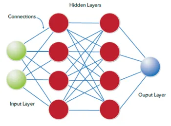

## Intro to Deep Learning

## Deep Learning
It is a complex and powerful subset of ML and foundational for modern AI models
# DL models
Good for handling big data and shines when fed big datasets

## Neural Networks
It is an ML algorithm that mimics the structure of the brain, linking many small functions together to model complex non linear relationships

Neural networks operate in layers:
 1. Input layer
 2. Hidden layer
 3. Output layer

 

Deep learning refers to particular to neural networks with multiple hidden layers

Neural nets mimic brain operations:
 1. A neuron "fires" (i.e activates) in response to how "excited" it gets
 2. "Neurons that fire together, wire together

## Activation Function
This are instructions for how a neuron fires in response to a combination of its input, weight and bias

The weight, w and the bias b are part of a linear regression within each neuron.

The linear regression equation, h=wx + b is inserted into the activation function f(h)

## Rectified Linear Unit (ReLU)
An activation function that outputs 0 when h < 0 and outputs h when h > 0